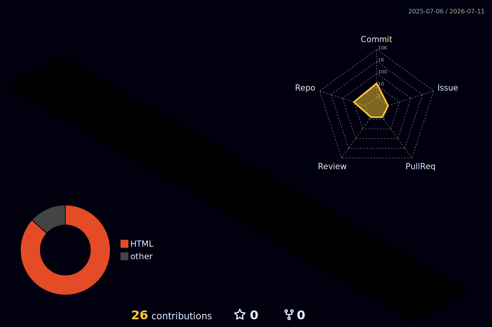

  

  
  
  

<h2 align="center">Hi, I am Liu Yukun</h2>

  I build useful software, explore AI-native workflows, and turn ideas into polished interfaces.

  

## Focus

| Area | What I care about |
|---|---|
| Product | Clear workflows, fast feedback, practical polish |
| Engineering | Maintainable code, automation, reliable delivery |
| AI | Human-in-the-loop tools, agents, knowledge workflows |

## Stack

  

## Activity

  
  

  

  

  

## Contact

  
  

  

